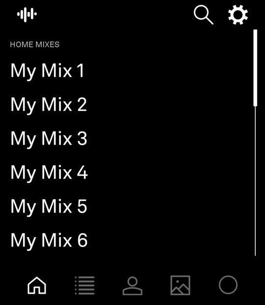
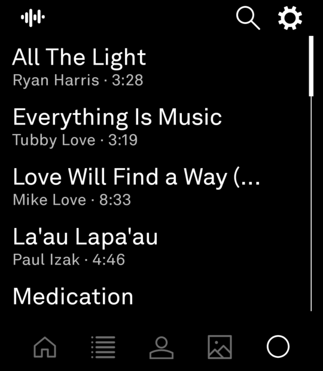
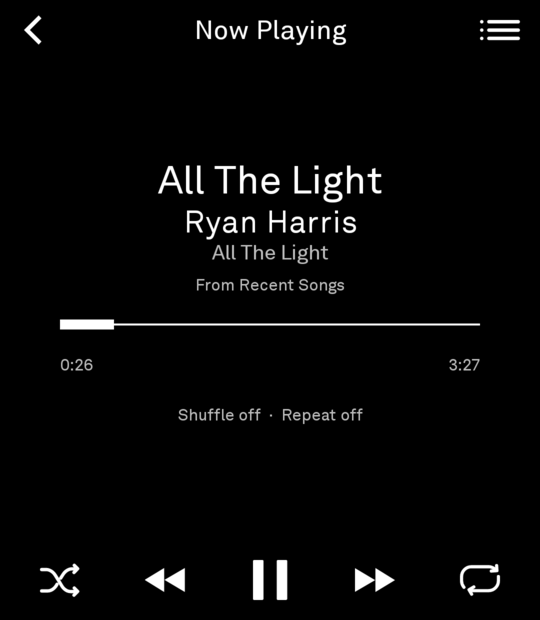

<p align="center">
  
</p>

<h1 align="center">Kelp</h1>

<p align="center">
  A small, e-ink-friendly TIDAL client for the Light Phone III.<br>
  Full-length streaming, monochrome UI, no clutter.
</p>

<p align="center">
  
  
  
</p>

## What is it?

Kelp streams TIDAL the way you actually use it — your saved songs, albums, artists, playlists, daily mixes, and search — squeezed into a calm, text-first interface that fits a minimal phone. Under the hood it runs the Light SDK and plays real, full-length tracks through its own Media3/ExoPlayer pipeline, using the same proven technique as [phono](https://github.com/jonathancaudill/phono) and the other community clients (orpheusdl, streamrip).

**You need a paid TIDAL subscription.** Like phono, kelp never works around that and never will.

## Install

1. Grab the latest APK from [**Releases**](https://github.com/LooseWireDev/kelp/releases).
2. Enable USB debugging on your LP3 (developer options), then:
   ```bash
   adb install kelp-v0.2.0-vc2.apk
   ```
3. Open Kelp and sign in. The login runs in two steps back-to-back with the same TIDAL account (one for the catalog, one for playback) — complete them both.

Kelp is **sideload-only** today. It can't go through Light's hosted tool builder, because the builder ignores companion modules and doesn't allowlist the TIDAL SDK — so the TIDAL code lives in a runtime-only server module inside the APK. If that ever changes upstream, this section changes first.

## Features

- Saved songs, albums, artists, playlists (your whole collection, paginated)
- Home mixes (daily / discovery / new-release) + recently played
- Full catalog search with per-section paging
- Queue with shuffle, repeat, seek, and "keep playing similar songs" continuous playback
- LOSSLESS streaming by default (falls back to lower quality if needed)
- Follows LightOS theming and hardware-button navigation

## Build it yourself

You'll need JDK 17, an Android SDK (platform 36), and the companion Light SDK checkout at `../light-sdk` (branch `codex/kelp-official-sdk`, based on upstream v0.1.1 plus kelp's small compatibility patches):

```bash
./gradlew :app:assembleDebug
adb install -r app/build/outputs/apk/debug/app-debug.apk
```

For release-quality builds (runs the tests, R8, signed, into `dist/`):

```bash
scripts/build-release.sh
```

You'll also want your own TIDAL developer credentials in `local.properties` (see `local.properties.example`) if you're hacking rather than installing releases.

CI runs tests + assemble on every push; pushing a matching `v*` tag publishes a signed release automatically.

## Legal / disclaimers

Unofficial project, unaffiliated with TIDAL or Light. A paid TIDAL subscription is required for everything to work. If TIDAL rotates their first-party client id (you'll notice as playback suddenly failing), the fix procedure is documented in [docs/TIDAL_ARCHITECTURE.md](docs/TIDAL_ARCHITECTURE.md).

## More reading

- [docs/TIDAL_ARCHITECTURE.md](docs/TIDAL_ARCHITECTURE.md) — why the two-sign-in model exists, stream resolution, API map
- [docs/PRODUCT.md](docs/PRODUCT.md) — product decisions
- [AGENTS.md](AGENTS.md) — repo map and rules for working on the codebase

Apache-2.0.
